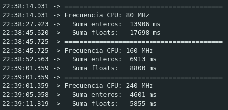
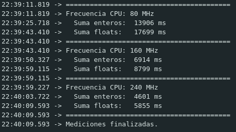

# ESP32 Análisis

Se realizo un analisis de tiempo de un programa en una placa ESP32.

Para este ensayo se cambio la frecuencia de reloj y se ejecutaron operaciones con enteros y punto flotante. A continuacion se muestra el codigo.

## Codigo utilizado

```cpp
void setup() {
  int frecuencias[] = {80, 160, 240};
  int cantFreqs = 3;
  
  for (int f = 0; f < cantFreqs; f++) {
    setCpuFrequencyMhz(frecuencias[f]);
    Serial.println("=========================================");
    Serial.print("Frecuencia CPU: ");
    Serial.print(getCpuFrequencyMhz());
    Serial.println(" MHz");

    // ── TEST 1: Suma de enteros ───────────────────────────
    volatile long sumaInt = 0;
    unsigned long t1 = millis();

    for (long i = 0; i < 100000000L; i++) {
      sumaInt += i;
    }

    unsigned long t2 = millis();
    Serial.print("  Suma enteros:  ");
    Serial.print(t2 - t1);
    Serial.println(" ms");

    // ── TEST 2: Suma de floats ────────────────────────────
    volatile float sumaFloat = 0.0;
    unsigned long t3 = millis();

    for (long i = 0; i < 100000000L; i++) {
      sumaFloat += (float)i * 0.1f;
    }

    unsigned long t4 = millis();
    Serial.print("  Suma floats:   ");
    Serial.print(t4 - t3);
    Serial.println(" ms");

  }

  Serial.println("=========================================");
  Serial.println("Mediciones finalizadas.");
}

void loop() {}
```

Luego de algunas ejecuciones se obtuvieron los siguientes resultados:





Podemos observar que los resultados son bastante parecidos entre simulaciones. Además podemos corrobar que la teoría se condice ya que la duración del programa es siempre mayor al trabajar con números de punto flotante. También, al variar la frecuencia del procesador el tiempo de ejecución va variando, notando que al reducirlo a la mitad el tiempo también se reduce de manera proporcional.
